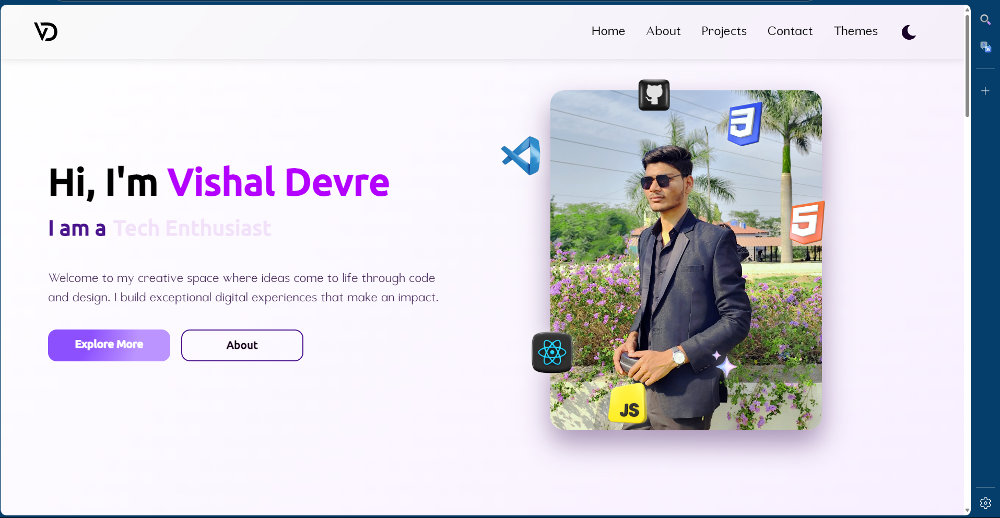

# 🌟 Vishal Devre's Portfolio Website  
A modern, responsive showcase of my frontend skills.  

[](https://portfoliovd-five.vercel.app)  
[](https://github.com/Vishal-Devre)  



## *✨ Features*  
- 🎨 *6 Dynamic Themes + Dark Mode*  
- 🚀 *GSAP & AOS Animation* (60 FPS optimized)  
- 📱 *Fully Responsive* (Mobile to 4K)  
- 📩 *EmailJS Contact Form* (Messages sent directly to your inbox) 

## *🛠 Tech Stack*  
- *Frontend*: React + Vite  
- *Animations*: GSAP, AOS  
- *Styling*: CSS3, Flexbox/Grid  
- *Deployment*: Vercel  

## *🚀 Installation*  
1. Clone the repo:  
   ```bash
   git clone https://github.com/Vishal-Devre/portfoliovd.git